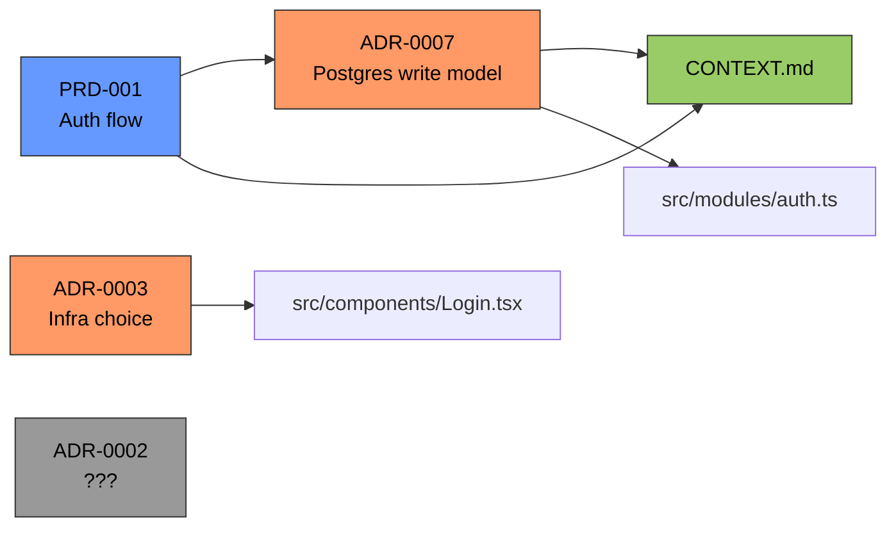

# Artifact Mapper

Scan project artifacts and generate a cross-reference relationship map.

## Artifact Types

Look for these in the project root and `docs/`:

| Type | Patterns |
|------|----------|
| ADR | `docs/adr/*.md`, `docs/adrs/*.md`, `docs/decisions/*.md` |
| PRD | `docs/prd/*.md`, `docs/specs/*.md`, `*.prd.md` |
| Context | `CONTEXT.md`, `context.md` |
| Agent guides | `AGENTS.md`, `MINDSET.md`, `MINDSET.md` |
| General docs | `README.md`, `docs/**/*.md` |

## Instructions

1. **Discover**: Find all artifacts matching the patterns above. Skip `node_modules/`, `.git/`, `dist/`.

2. **Extract** from each file:
   - **Title**: first H1 or frontmatter `title` field
   - **Type**: ADR, PRD, context, guide, doc
   - **Terms**: nouns/entities mentioned (names of modules, services, concepts)
   - **References**: filenames or patterns mentioned in backticks, links, or "see ADR-XXX", "per PRD-XXX" patterns
   - **Status** (ADRs only): accepted, deprecated, superseded-by

3. **Map relationships**:
   - **Explicit**: file A references file B (link, backtick mention, ADR-XXXX)
   - **Implicit**: file A and file B share 3+ key terms
   - **Orphan**: artifact referenced by nobody
   - **God node**: artifact with most incoming references
   - **Surprise**: cross-domain connection (e.g., infra ADR referenced from UI code)

4. **Generate `GRAPH_REPORT.md`** at `docs/graph-report.md`:

```markdown
# Artifact Map — [project name]

Generated: [date]

## Relationship Graph



> Nodes with most connections = god nodes. Gray nodes = orphans.

## Summary
- Total artifacts: N
- Edges found: N
- Orphans: N
- God nodes: N

## Nodes

| Artifact | Type | Status | References | Referenced By |
|----------|------|--------|-----------|---------------|
| ADR-0007 | ADR | accepted | 3 files | 5 files |

## Edges

| From | To | Type |
|------|----|------|
| ADR-0007 | src/modules/auth.ts | explicit |
| PRD-001 | CONTEXT.md | implicit (shared: auth, tokens, session) |

## God Nodes
1. ADR-0007 (Postgres write model) — 5 incoming refs
2. CONTEXT.md — 3 incoming refs

## Surprises
- ADR-0003 (infra choice) referenced from `src/components/Login.tsx` — cross-domain link

## Orphans
- ADR-0002 — no references found. Consider removing or linking.

## Recommendations
- PRD-001 mentions "auth" but no ADR covers auth decisions
- CONTEXT.md missing terms: "session", "refresh_token"
```

## Mermaid Graph Rules

- **Direction**: `graph LR` (left-to-right). Use `graph TB` if >15 nodes.
- **Node format**: `ID[Label\nSubtitle]` — include a short subtitle for context.
- **Arrow direction**: `From --> To` means "From references/depends on To".
- **Colors by type**:
  - ADRs: `fill:#f96,stroke:#333,color:#000` (orange)
  - PRDs/Specs: `fill:#69f,stroke:#333,color:#000` (blue)
  - Context/Guides (AGENTS.md, CONTEXT.md): `fill:#9c6,stroke:#333,color:#000` (green)
  - Code files: `fill:#c9f,stroke:#333,color:#000` (purple)
  - Orphans: `fill:#999,stroke:#333,color:#000` (gray)
- **Size**: god nodes get bold labels. `ID**> Label **`
- **Layout**: group by type using subgraphs if >10 nodes.
- **Render**: Mermaid renders natively in Obsidian and GitHub.

## Rules

- Only scan markdown files (`.md`)
- Ignore code files (`.ts`, `.js`, `.py`) for implicit references unless explicitly asked
- Report paths relative to project root
- Keep terms lowercase and deduplicated
- If no artifacts found, say "No mappable artifacts found in this project"
